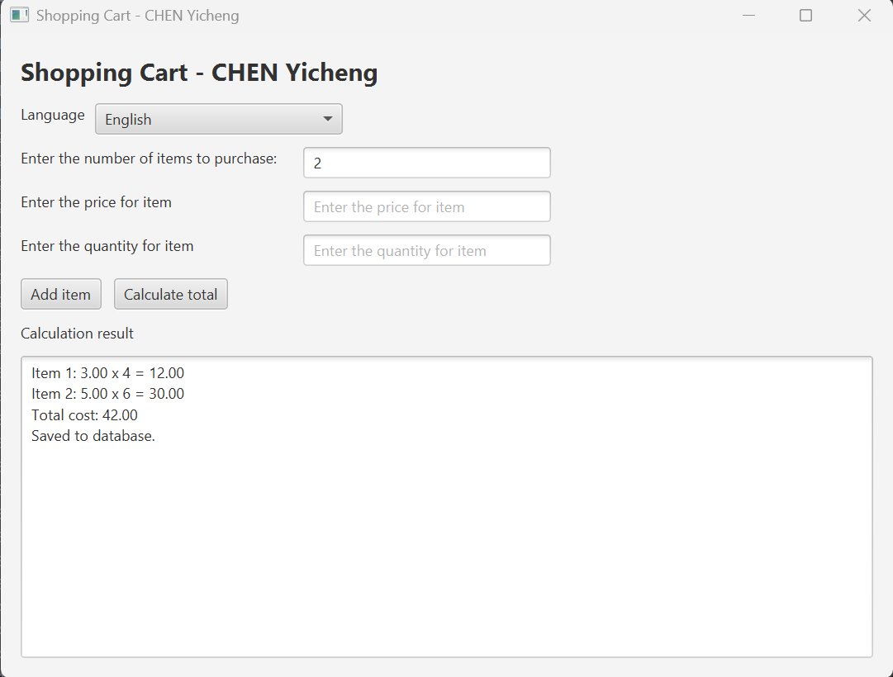
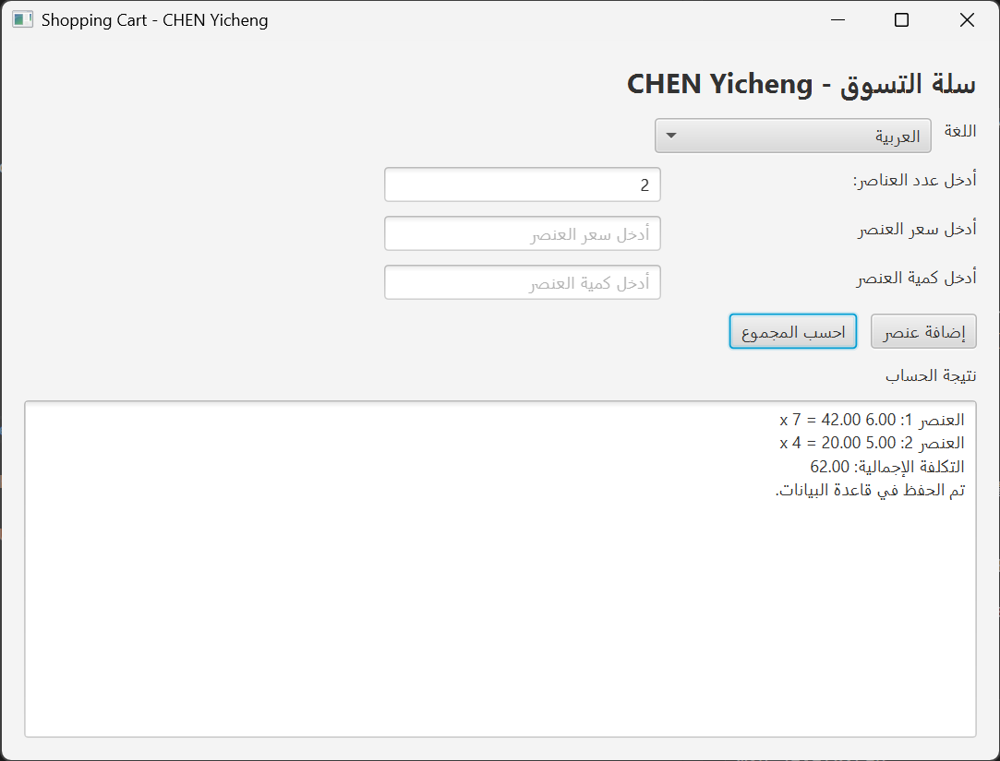
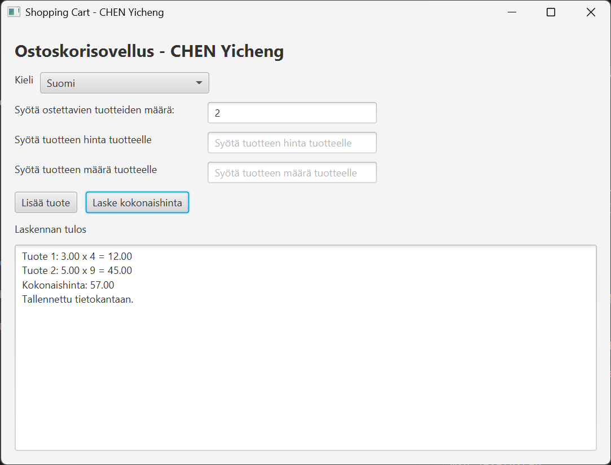
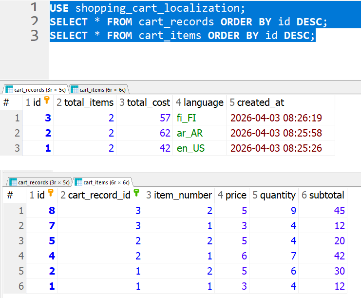
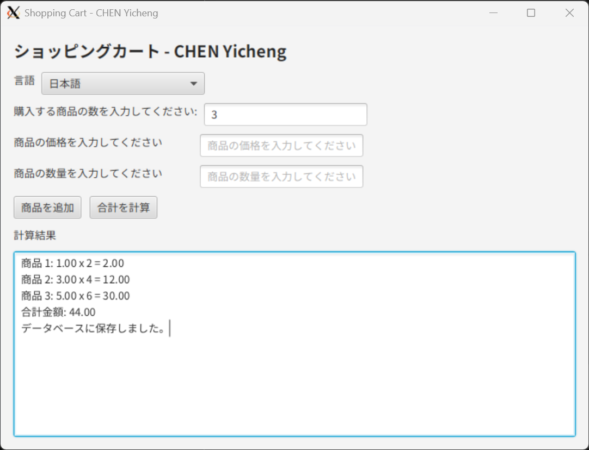
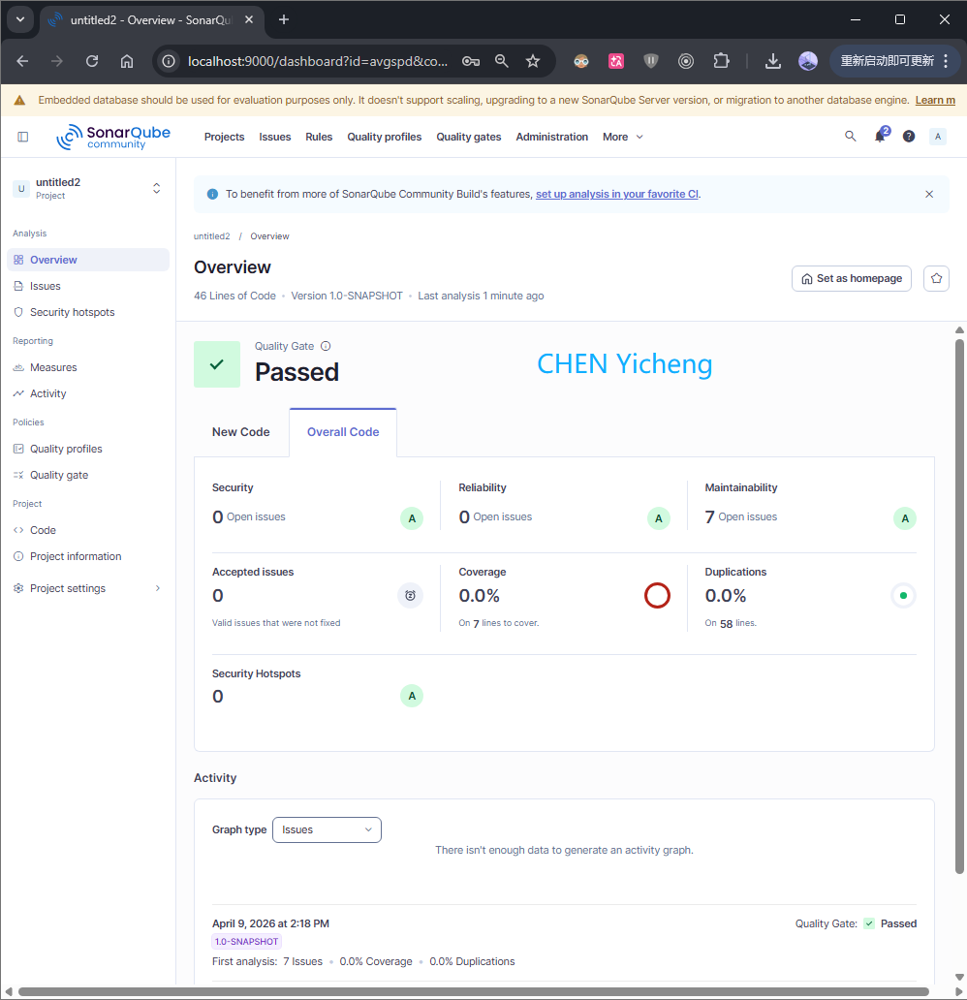

# Shopping Cart Localization Project

## Implemented Features

- JavaFX GUI application
- Multi-item shopping cart flow:
  - Enter number of items
  - Enter item price and quantity
  - Add multiple items
  - Calculate item subtotals and overall total
- Localization support:
  - English (`en_US`)
  - Finnish (`fi_FI`)
  - Swedish (`sv_SE`)
  - Japanese (`ja_JP`)
  - Arabic (`ar_AR`) with RTL UI direction
- Localization source:
  - Reads from database table `localization_strings`
  - Falls back to `MessagesBundle_*.properties` if DB keys are missing
- Database persistence:
  - Saves shopping cart summary to `cart_records`
  - Saves item rows to `cart_items` (foreign key to `cart_records`)
- Unit tests (JUnit 5) and coverage (JaCoCo)
- CI/CD files: `Dockerfile`, `Jenkinsfile`

## Tech Stack

| Component             | Version |
| --------------------- | ------- |
| Java                  | 17      |
| Maven                 | 3.9+    |
| JavaFX                | 21.0.5  |
| MariaDB Java Client   | 3.4.1   |
| JUnit Jupiter         | 5.10.0  |
| Mockito               | 5.6.0   |
| JaCoCo                | 0.8.10  |
| Maven Surefire Plugin | 3.1.2   |

## Quick Start

### 1) Prerequisites

- JDK 17
- Maven 3.9+
- MySQL or MariaDB

### 2) Clone and open project

```bash
git clone https://github.com/chenyicheng1998/software-project2-week1-shopping-cart.git
cd shopping-cart
```

### 3) Create database schema

Run `src/main/resources/db/schema.sql` against your MariaDB/MySQL instance. It creates the following tables (all `IF NOT EXISTS`):

| Table                  | Purpose                                                                          |
| ---------------------- | -------------------------------------------------------------------------------- |
| `cart_records`         | One row per cart session (`total_items`, `total_cost`, `language`, `created_at`) |
| `cart_items`           | One row per item (`price`, `quantity`, `subtotal`, FK → `cart_records`)          |
| `localization_strings` | UI label strings keyed by `key` + `language`                                     |

The script also **seeds 12 English (`en_US`) localization strings** into `localization_strings` automatically. Two keys (`invalid.number`, `db.error`) are intentionally **not seeded** — at runtime they always fall back to `MessagesBundle_en_US.properties`.

Option A (MySQL client):

```sql
SOURCE src/main/resources/db/schema.sql;
```

Option B: open `src/main/resources/db/schema.sql` and execute manually.

### 4) Configure database connection (optional)

By default, the app uses (`DatabaseConnection.java`):

- `DB_URL=jdbc:mariadb://localhost:3306/shopping_cart_localization`
- `DB_USER=root`
- `DB_PASSWORD=` _(empty string)_

If your local credentials differ, set environment variables before running:

Windows PowerShell:

```powershell
$env:DB_URL="jdbc:mariadb://127.0.0.1:3306/shopping_cart_localization?useSsl=false&restrictedAuth=mysql_native_password"
$env:DB_USER="root"
$env:DB_PASSWORD="your_password"
```

Linux/macOS:

```bash
export DB_URL="jdbc:mariadb://127.0.0.1:3306/shopping_cart_localization?useSsl=false&restrictedAuth=mysql_native_password"
export DB_USER="root"
export DB_PASSWORD="your_password"
```

### 5) Run tests

```bash
mvn clean test
```

To also generate the **JaCoCo coverage report** (runs at the `verify` phase):

```bash
mvn clean verify
```

Report is written to `target/site/jacoco/index.html`.

### 6) Run application (GUI)

```bash
mvn javafx:run
```

## Screenshots








## How to Verify Functionality

1. Select a language from dropdown.
2. Enter number of items.
3. Enter price and quantity for each item, click `Add item`.
4. Click `Calculate total`.
5. Confirm results appear in UI and data is saved to DB.

Check database:

```sql
USE shopping_cart_localization;
SELECT * FROM cart_records ORDER BY id DESC;
SELECT * FROM cart_items ORDER BY id DESC;
```

## Reset Data

```sql
USE shopping_cart_localization;
SET FOREIGN_KEY_CHECKS = 0;
TRUNCATE TABLE cart_items;
TRUNCATE TABLE cart_records;
SET FOREIGN_KEY_CHECKS = 1;
```

## Docker

The image uses a **multi-stage build**:

| Stage   | Base image                     | Purpose                               |
| ------- | ------------------------------ | ------------------------------------- |
| `build` | `maven:3.9-eclipse-temurin-17` | Compile and package the JAR           |
| runtime | `maven:3.9-eclipse-temurin-17` | Run `mvn javafx:run` with GUI support |

The runtime stage installs the following Linux libraries required by JavaFX:

- X11/display: `libx11-6`, `libxext6`, `libxrender1`, `libxtst6`, `libxi6`
- GTK3 / OpenGL: `libgtk-3-0`, `libgl1`, `libasound2t64`
- Font support (CJK / emoji): `fonts-noto-cjk`, `fonts-noto-color-emoji`, `fontconfig`

Default environment variables baked into the image:

| Variable            | Default value                                                                                                           |
| ------------------- | ----------------------------------------------------------------------------------------------------------------------- |
| `LANG`              | `en_US.UTF-8`                                                                                                           |
| `LC_ALL`            | `C.UTF-8`                                                                                                               |
| `JAVA_TOOL_OPTIONS` | `-Dfile.encoding=UTF-8 -Dstdout.encoding=UTF-8`                                                                         |
| `DB_URL`            | `jdbc:mariadb://host.docker.internal:3306/shopping_cart_localization?useSsl=false&restrictedAuth=mysql_native_password` |
| `DB_USER`           | `root`                                                                                                                  |

Pull image from Docker Hub:

```bash
docker pull chenyicheng1998/shopping-cart:latest
```

Or build locally:

```bash
docker build -t chenyicheng1998/shopping-cart:latest .
```

Run image (GUI mode with X11 forwarding):

- Start Xming first (recommended: disable access control).

Windows PowerShell:

```powershell
docker run -it --rm `
  -e DISPLAY=host.docker.internal:0.0 `
  -e DB_URL="jdbc:mariadb://host.docker.internal:3306/shopping_cart_localization?useSsl=false&restrictedAuth=mysql_native_password" `
  -e DB_USER=root `
  -e DB_PASSWORD=your_password `
  chenyicheng1998/shopping-cart:latest
```

## Jenkins Pipeline

The `Jenkinsfile` is designed for a **Windows Jenkins agent** (uses `bat` commands). Docker Hub credentials must be stored in Jenkins with the ID `Docker_Hub`.

| Stage              | Command                                                  | Notes                                                        |
| ------------------ | -------------------------------------------------------- | ------------------------------------------------------------ |
| Checkout           | `checkout scm`                                           | Pulls source from SCM                                        |
| Test               | `mvn --batch-mode clean test`                            | JUnit results collected from `target/surefire-reports/*.xml` |
| Package            | `mvn --batch-mode clean package -DskipTests`             | Produces the runnable JAR                                    |
| Build Docker Image | `docker build -t chenyicheng1998/shopping-cart:latest .` |                                                              |
| Push to Docker Hub | `docker push chenyicheng1998/shopping-cart:latest`       | Login via `DOCKERHUB_CREDENTIALS`                            |

After every build (success or failure) the agent runs `docker logout`.

## SonarQube

Static analysis can be run in two ways with **different project keys**:

| Method              | Config file                | `sonar.projectKey` used |
| ------------------- | -------------------------- | ----------------------- |
| `mvn sonar:sonar`   | `pom.xml`                  | `shopping-cart`         |
| `sonar-scanner` CLI | `sonar-project.properties` | `avgspd`                |

Both point to the same host (`http://localhost:9000`). Choose one method consistently so results accumulate under the same project in SonarQube.

`sonar-project.properties` settings:

| Property               | Value                   |
| ---------------------- | ----------------------- |
| `sonar.projectKey`     | `avgspd`                |
| `sonar.projectName`    | `shopping-cart`         |
| `sonar.projectVersion` | `1.0`                   |
| `sonar.sources`        | `src`                   |
| `sonar.java.binaries`  | `target/classes`        |
| `sonar.host.url`       | `http://localhost:9000` |

Run via Maven (after `mvn compile`):

```bash
mvn sonar:sonar
```

Or using the SonarScanner CLI:

```bash
sonar-scanner
```
